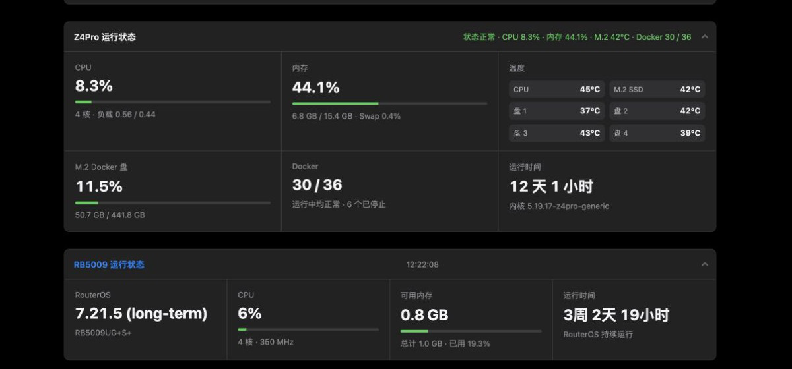
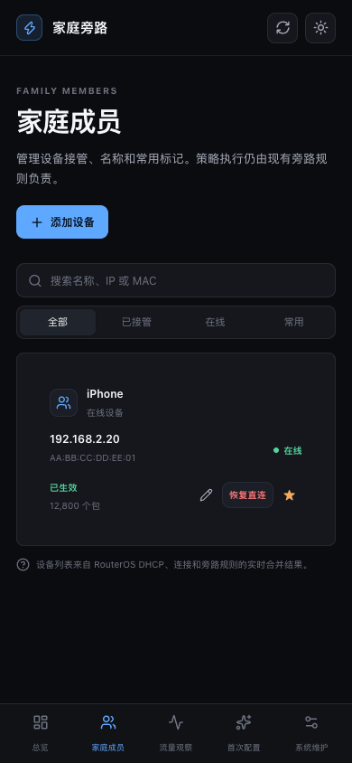
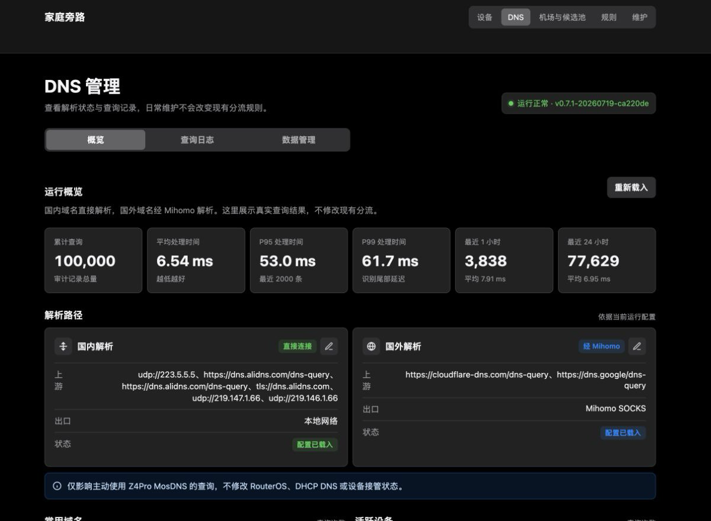
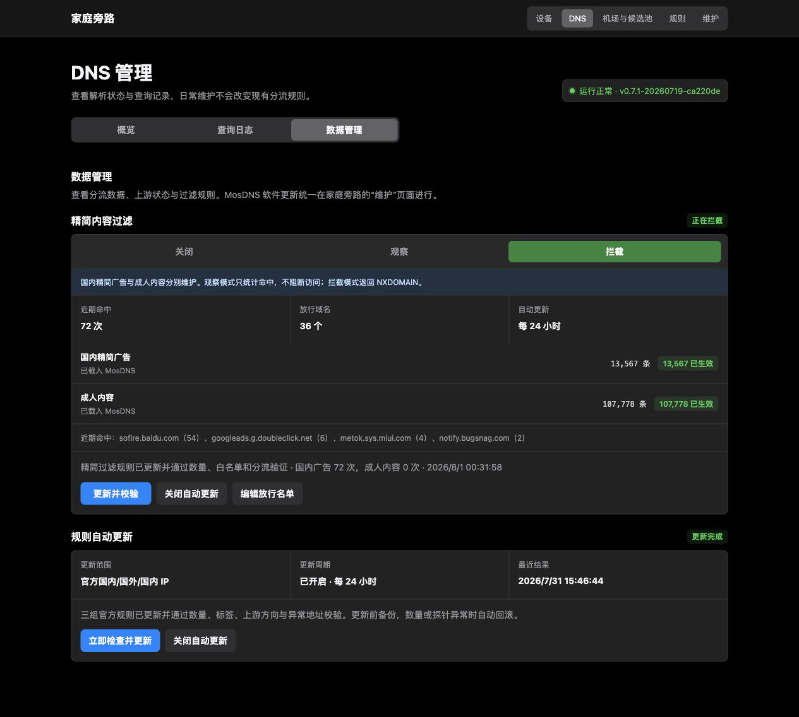
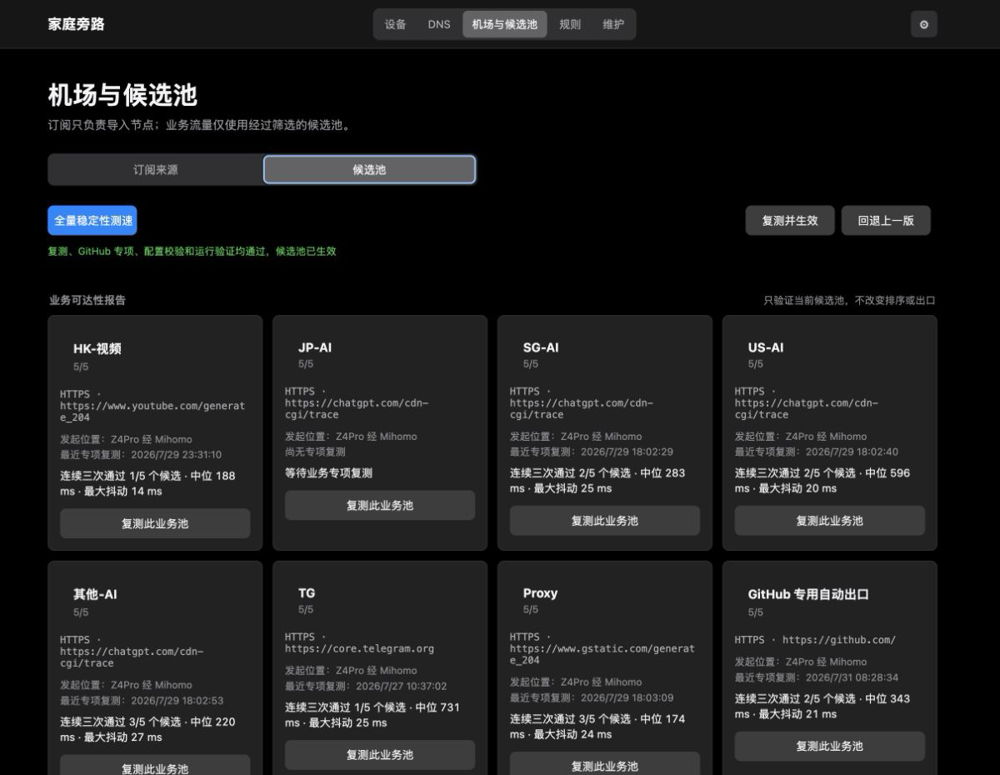
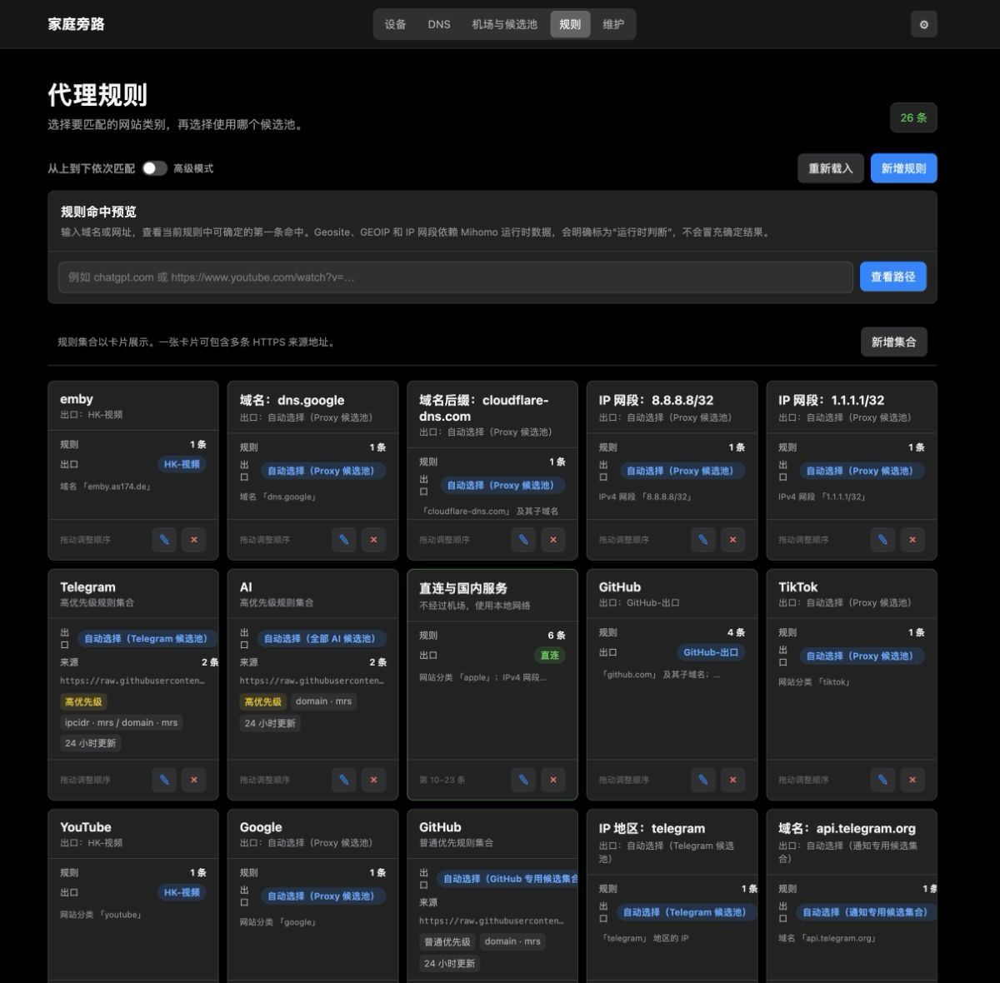
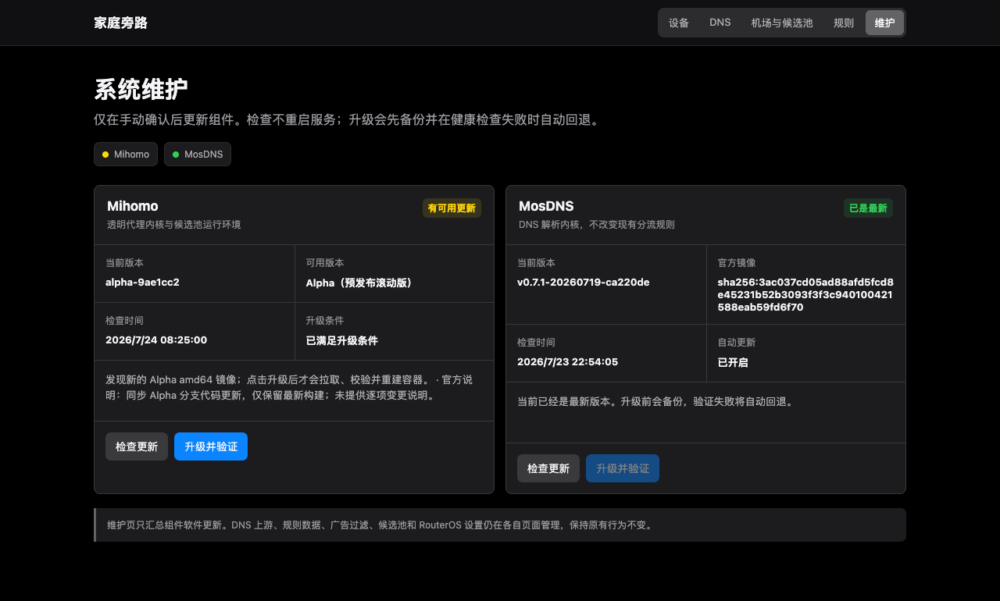
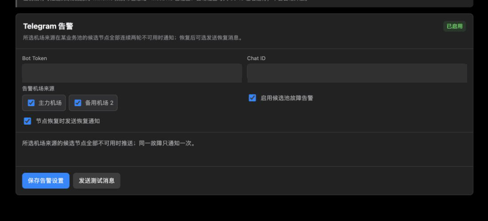

# 家庭旁路代理系统：手动运维说明

当前前端控制台版本：`0.11.6`。

这是一套面向家庭网络的选择性旁路代理运维说明。它的目标是：只让手工选中的设备使用旁路服务，其余设备保持原有网络行为；订阅、候选节点、DNS 和规则均可在局域网管理页面中独立维护。

> 本文只描述操作流程，不包含可用订阅、账户密码、私钥、Cookie、真实公网域名或家庭网络地址。

## 控制界面

### Apple 风格控制台

根路径现在使用独立的 Vue 3 + TypeScript + Tailwind CSS 控制台，采用深浅色主题、响应式侧栏/移动端导航、状态卡片和 Lucide 线性图标。总览、接管设备、流量观察、首次配置和系统维护五个视图直接读取现有 `/api/*` 接口；不具备后端历史数据或策略写入接口的内容会明确显示为当前快照或待接入，不生成假数据。

“接管设备”页面集中管理旁路接管、HomeKit 本地直连、设备名称和 Apple 风格设备图标。总览中的“已接管设备”数字只统计实际被旁路接管的设备，点击卡片可直接进入设备页；“规则配置”入口保留现有 `/rules` 页面，并同时提供桌面侧栏和移动端入口。首次配置完成后，安装向导入口会自动隐藏，避免误跳回总览；需要重新安装时应在 NAS 终端重新生成一次性向导地址。

新版控制台右上角提供“回到旧版入口”，左侧栏底部右侧提供“回到原版”入口，两者均进入 `/legacy` 原管理界面；旧版设备管理页将“新版控制台”入口放在顶栏最右侧。两个界面可以互相切换，原有规则、DNS、机场和维护页面继续使用原路径。

前端在发布前构建为静态文件，旁路主机只运行现有 Python 控制面，不需要安装 Node.js：

```bash
cd frontend
npm install
npm run typecheck
npm run build
```

`frontend/dist` 会随发布提交，`install-server.sh` 和 `deploy-family-proxy-ui` 会将它复制到 `/opt/family-proxy-ui/frontend`。统一入口仍由 `family-proxy-gateway` 提供，原有 DNS、机场、规则和旧版维护页面继续保留。

以下截图来自脱敏的实际管理页面状态，用于说明日常操作入口；图片不包含订阅链接、节点地址、设备 IP/MAC 或登录凭据。

### 设备与运行状态

以下为新控制台的桌面总览，数据区域使用脱敏的本地模拟状态，仅用于展示布局。



### 设备接管

以下为新控制台移动端设备页，名称、IP 和 MAC 均为脱敏示例，保留接管状态与日常操作入口。



### DNS 管理



### DNS 数据管理、广告拦截与自动更新



### 机场与候选池



### 代理规则



### 系统维护



### Telegram 推送与告警

Bot Token 与 Chat ID 已在截图中遮挡，保留告警来源、故障与恢复通知以及测试消息入口。



## 人工部署快速开始

首次部署应在一台已安装 Docker、Docker Compose 插件和 `systemd` 的旁路服务器上完成。安装器只部署控制平面，不会自动改 RouterOS、导入订阅、接管设备或覆盖已有同名 Docker 容器。

### 最短首次部署

适用于已具备 Docker、systemd、固定 LAN IPv4，且 RouterOS API 已限制为只允许旁路主机访问的同类服务器：

```bash
git clone https://github.com/liuleisail/family-proxy-manual.git
cd family-proxy-manual
sudo ./scripts/bootstrap-interactive.sh
```

脚本会展示本机网卡地址，询问 LAN、旁路主机 IP、RouterOS API 凭据、管理页凭据和 SSD 数据目录；凭据仅写入权限为 `600` 的 `/etc/family-proxy-ui/router.env`。随后它自动执行控制平面安装、基础 Mihomo 容器创建、服务启动和本机验证。管理页密码会立刻转换为 PBKDF2 哈希，明文不会保留。

该入口**不**自动写 RouterOS、接管设备、导入订阅，或覆盖已有 Mihomo/MosDNS 容器。RouterOS 必须先在终端审阅并导入模板；现有 MosDNS 仅按兼容安装步骤对接。这是为了在不同家庭网络上仍保留可恢复边界，而不是把现网规则打包进镜像。

### 一键安装与首次启动向导

新服务器也可以使用网页向导完成首次设置：

```bash
git clone https://github.com/liuleisail/family-proxy-manual.git
cd family-proxy-manual
sudo ./scripts/install-one-click.sh
```

脚本只在终端询问启动网关所需的 LAN、旁路 IP、接口和数据目录；安装完成后输出一个仅局域网可访问的一次性地址。用同一局域网设备打开该地址，在进入管理页前填写 RouterOS API、管理页账号、DNS 页面认证及可选 GEO 更新策略。向导提交后会原子更新 `router.env`、删除一次性令牌、重启控制面并进入正常登录页。RouterOS 规则、订阅和客户端接管仍需人工审阅，不会被一键安装自动执行。

该入口要求服务器已经安装 Docker Engine、Compose 插件和 `systemd`；它不会替换已有 Docker、Mihomo、MosDNS 或 RouterOS 配置。安装器输出的向导地址只应在家庭局域网内打开，不要通过 Telegram、工单或公网反向代理转发。向导完成后先执行：

```bash
sudo ./scripts/verify-server.sh
```

确认控制面和本机服务正常后，再按 [DEPLOYMENT.md](DEPLOYMENT.md) 审阅 RouterOS 模板、接入现有 DNS，并只加入一台测试设备。

### 可选：建立专用运维密钥账号

建议把日常人工管理员和旁路运维通道分开。旁路服务器可建立一个独立的 SSH 运维账号：仅允许一把保存在操作者电脑本地的 ED25519 私钥登录，禁用该账号的密码登录；需要无交互维护时，再通过受控的 `sudoers` 规则授权。这个账号等同于拥有相应的系统维护权限，因此私钥必须为本机私有文件（权限 `600`），不能上传到仓库、NAS 共享目录或聊天工具。

RouterOS 不应额外创建一个不受限制的全权账号。管理页面应使用单独的 RouterOS 控制账号，并同时限制来源为旁路服务器 IP、仅开启 SSH/read/write 等实际所需权限，并使用独立公钥。页面已有可用控制账号时，复用并核验该账号即可，不要为了“免输密码”创建第二个高权限账号。

变更前备份服务器的 `/etc/passwd`、`/etc/shadow`、`/etc/sudoers*` 和 SSH 配置，以及 RouterOS 的文本/二进制备份。创建后必须实际验证三件事：密钥登录成功、密码登录被拒绝、控制器到 RouterOS 的专用密钥仍可登录。回滚时删除该 NAS 账号对应的 `authorized_keys`、`sudoers` 和 SSH `Match User` 配置，再重新加载 SSH；RouterOS 侧仅在专用控制账号不再被页面使用时才删除其公钥和账号。

### 1. 获取项目并填写本地私密配置

```bash
git clone https://github.com/liuleisail/family-proxy-manual.git
cd family-proxy-manual
sudo install -d -m 700 /etc/family-proxy-ui
sudo install -m 600 config/router.env.example /etc/family-proxy-ui/router.env
sudoedit /etc/family-proxy-ui/router.env
```

只需要填写本机 LAN、旁路主机 IP、承载受管设备流量的 LAN 桥接口、RouterOS API 地址/账号/密码和管理页账号/密码。Z4Pro 的桥接口通常是 `kvmbr0`，其它服务器先用 `ip -br link` 核实。`router.env` 不会被提交；首次安装后明文 `UI_PASSWORD` 会自动转换为哈希并删除。

### 2. 部署控制平面与 Mihomo

```bash
sudo ./scripts/install-server.sh
sudo ./scripts/install-mihomo-container.sh
sudo ./scripts/install-server.sh --start
sudo ./scripts/verify-server.sh
```

第一条命令会生成带时间戳的本地备份、渲染程序、安装 systemd 服务，但不启动服务；在 Debian/Ubuntu 上还会按需安装 `python3-yaml`、用于温度读取的 `lm-sensors`，以及设备诊断所需的 `tcpdump` 和 `prlimit`。第二条命令只在不存在 `family-mihomo-fallback` 容器时创建基础 Mihomo 容器。第三、四条命令启动服务，并验证控制平面、系统状态、机场状态和抓包容量限制。

安装前请确认仓库中存在已构建的 `frontend/dist/index.html`；从源码开发时先按上面的前端命令构建。安装脚本会在复制静态文件前检查该文件，避免服务启动后根路径落回旧界面。

DNS 必须先由服务器上现有的 MosDNS/DNS 服务监听旁路主机的 `53` 端口；本项目故意不自动接管端口 `53`，避免影响现有家庭 DNS。

MosDNS-T 的推荐加固配置见 [MOSDNS.md](MOSDNS.md)。其中包含分流前总缓存的处理、国内外独立缓存、规则优先级、HTTPDNS 精简清单、自动更新校验和回滚要求。

### 3. 准备 RouterOS，再接管测试设备

1. 先在 RouterOS 运行 `routeros/01-preflight-and-backup.rsc`，保存文本导出和二进制备份。
2. 填写 LAN 网段和旁路主机 IP 后，运行 `routeros/02-prepare-controller.rsc`。它创建一套共享策略和空的设备地址列表；列表为空时不会接管任何设备。
3. 确保 RouterOS API 仅允许旁路主机访问，再打开局域网管理页导入订阅、筛选候选池。
4. 仅加入一台测试设备，验证国内 App、局域网服务和外网服务；通过后再加入其它设备。

管理页不可用时才使用 `routeros/03-enable-device-template.rsc` 手工接管单台设备；回滚使用 `routeros/99-remove-device-template.rsc`。同一设备不能同时由网页和手工 RouterOS 模板管理。

完整的部署、升级与恢复流程见 [DEPLOYMENT.md](DEPLOYMENT.md)，RouterOS 命令说明见 [routeros/README.md](routeros/README.md)。

## 一、使用边界

- 家庭设备默认保持直连；只有在“设备”页明确加入的设备才会被接管。
- 同一台设备只能处于一个代理平面：直连、主代理或旁路代理三选一，不能同时接入两个代理系统。
- 订阅由旁路主机使用本地网络直连获取，不经代理、Fake-IP、第三方订阅转换器或转换 API。
- 不把订阅链接、节点原文、环境变量、路由器导出、数据库备份和 TLS 私钥提交到 GitHub。
- 路由器规则只允许由控制器创建、修改和删除带有控制器标记的条目；手工规则不应混在同一个标记空间。

## 二、管理入口与页面职责

局域网访问统一管理入口并登录后，按下面的职责操作：

| 页面 | 日常用途 | 不做什么 |
| --- | --- | --- |
| 设备 | 查看旁路健康、RB5009 与 Z4Pro 资源、WireGuard 远程互联；加入或撤出单台设备、改名、保留常用设备、查看流量计数和执行短时抓包诊断 | “流量观察”默认收起，只汇总 RouterOS 当前连接/旁路标记和 Mihomo 当前策略组；不记录访问内容或完整域名，也不修改路由或策略。已接管设备可打开“链路”查看局域网、DNS、国内 IPv4、国外 TCP/UDP 与 IPv6 的实际策略路径 |
| DNS | 查看解析状态、缓存和日志；执行保留缓存的快速检查或严格分流回归；按需编辑 MosDNS 国内/国外上游 | 不自动修改 DHCP DNS 或强制重定向 |
| 机场与候选池 | 按需添加机场来源、全量测速生成建议、复测并生效、查看 fallback 切换 | 不长期对所有节点测速 |
| 规则 | 调整业务分流规则并生成可回退配置；用“规则命中预览”解释特定域名会使用的规则与策略 | 预览不修改配置；Geosite、GEOIP 和 IP 网段会明确交由 Mihomo 运行时判断，不伪造结果 |
| 维护 | 检查 Mihomo、MosDNS、RouterOS 通道与 Z4Pro ZOS 更新状态 | 系统更新只检测和推送，绝不自动升级或重启设备 |

每个页面右上角的“页面显示”齿轮可像 iPhone 的编辑列表一样拖动手柄排序，也可用上下箭头调整，适合 iPad/iPhone 触控操作。设备页会把设备管理、按 IP 手动加入和全部运行区块一起纳入排序；前两项固定显示，其余次要状态、说明或观察区块可按需隐藏。DNS 上游、订阅导入、规则编辑和维护操作等核心入口始终保留。该偏好保存在旁路主机，因此手机、iPad 和电脑会使用同一显示方式；点击“恢复默认”即可还原完整页面。

### HomeKit 本地视频直连

当 Homebridge/HomeKit 服务位于旁路主机，且摄像头画面在 iPhone、iPad 或 Apple TV 上持续转圈时，可在“设备 - 全部在线”中为摄像头、观看设备和 HomeKit Hub 选择“HomeKit 直连”。选择按 **MAC 地址** 保存；`homekit-direct-routes.timer` 每分钟从 RouterOS DHCP 租约解析当前 IP，并为旁路主机自身到这些设备维护独立的源地址策略路由。

它不会修改 RouterOS、Mihomo、MosDNS、设备默认网关或 DNS，因此不会让设备退出旁路，也不会改变其外网流量走向。TPROXY 返回流量仍经 RB5009 回到接管设备，避免同网段直返造成 TCP 握手延迟；取消选择后，控制器只删除自己记录的源地址策略。若 Apple 设备重置了私有 Wi-Fi 地址，需在“全部在线”中重新选择新 MAC；应优先使用固定 DHCP 租约。

共享旁路策略还会维护 `family-mihomo-shared multicast direct` mangle 规则，并将它放在共享连接标记之前，使受管设备的 mDNS/IGMP 组播留在局域网；这与“恢复直连”不同，不会撤销该设备的外网旁路。

设备页按日常操作顺序排列：设备管理、按 IP 手动加入、旁路运行状态、RB5009 状态、WireGuard 远程互联、Z4Pro 状态。“按 IP 手动加入”始终直接显示；从设备列表选择“加入旁路”时会自动填入地址。加入旁路会先把该设备当前 MAC/IP 转为 RouterOS 静态 DHCP 租约，并二次确认绑定成功后才写入旁路规则，因此设备重连 Wi-Fi 后仍使用同一 IP。常驻站点链路按最近握手显示正常、警告或故障；手机按需隧道未连接时显示灰色“待机”，不会误报故障。详情仅展示脱敏端点、流量、路由、NAT 和最近 7 天（最多 200 条）状态变化，不返回任何密钥。

首次操作前，确认管理页显示：Z4Pro 资源、RB5009 版本/CPU/可用内存/运行时间、DNS、Mihomo、当前策略和自动回退均为正常。Z4Pro 与 WireGuard 卡片每 10 秒更新，WireGuard 站点探针最多每 60 秒执行一次，RB5009 资源、设备与流量列表每 30 秒更新。Docker 的“运行数 / 总数”不会启动已停止容器；温度工具不可用时只显示“不可用”，其它状态仍可读取。任意关键项异常时，先修复健康状态，不要继续接管新设备。

Mihomo 的“维护”页默认只读。检查更新只接受 Docker Hub `latest`，且要求存在与其镜像摘要完全一致的 `v数字.数字.数字` 正式标签；Alpha、Beta、RC、Nightly 等版本不会进入检测结果。仓库不可达或两者摘要不一致时显示失败且不拉取、不重启。点击“升级并验证”后，系统才会备份当前 `config.yaml` 和 Compose 文件、为旧镜像保存本地回滚标签、拉取正式镜像、用现有配置校验，再重建唯一的 `family-mihomo-fallback` 容器。控制接口或 `Proxy-Auto` 策略组验证失败会自动恢复旧镜像和原 Compose；不会启动任何历史停用容器，也不会自动升级。

维护页的“系统更新与通知”每天约 09:15 检查一次（随机延后最多 10 分钟），并可手动检查。RouterOS 读取已设置的官方更新通道；Z4Pro 读取极空间 ZOS 自带升级服务的最近一次官方结果；Mihomo 与 MosDNS 仅执行镜像元数据比对。Mihomo 只检测并展示正式发布版本，Alpha、Beta、RC、Nightly 等预发布版会被忽略。其余组件发现版本变化时，会使用已启用的 Telegram 告警仅推送一次；不执行 RouterOS、ZOS、Docker 或 `apt` 升级，也不会重启任何服务。系统更新请仍在 RouterOS 或极空间官方界面确认后手动完成。

若家庭网络无法直连 Docker Hub，可把 `systemd/docker-mihomo-proxy.conf` 安装为 Docker 服务的 `http-proxy.conf`。该配置只让 Docker 守护进程通过本机 `127.0.0.1:7890` 拉取镜像，NAS 默认网关、局域网访问和既有容器运行流量不改。应用配置需重启 Docker；先确认 `docker info` 的 `Live Restore Enabled` 为 `true`，并备份、记录容器状态后再操作。

## 三、设备接入与撤出

### 加入一台设备

1. 在“设备 - 全部在线”中确认设备的名称、MAC 和当前 IP；Apple 设备应以 MAC 识别，不依赖可能变化的 DHCP 地址。
2. 可先给设备改一个易读名称；常用但暂不接管的设备可标记为“常用设备”。
3. 点击“加入旁路”，或在页面上输入当前 IP 后点击“加入并校验”。
4. 等待控制器完成健康检查、冲突检查、共享名单、IPv6 防漏和 Mihomo 接管同步。
5. 让设备重新连接 Wi-Fi，分别验证一个国内应用、一个网页视频服务和一个即时通信服务。

“等待新流量”只表示规则已创建但还没有观察到新连接。重新打开应用或切换一次 Wi-Fi 后应出现计数；若仍为零，按本文的“故障排查”检查。

### 短时抓包诊断

“已接管”设备会显示“诊断”按钮，可抓取该设备的全部、DNS、TCP 或 UDP 元数据，用于判断请求是否发出、DNS 返回是否延迟、连接是否重传，以及流量实际经过哪个方向。弹窗每秒刷新累计包数、文件大小和最近连接，日常排查无需下载；PCAP 下载只用于 Wireshark 深度分析。HTTPS 正文仍是加密内容，不会显示账号、密码或页面正文。

- 时长只能选择 30 秒、1 分钟或 3 分钟；全机同一时间只运行一个任务。
- 单文件硬限制 50 MB，所有文件合计不超过 200 MB，超过 24 小时自动删除。
- 文件位于 `/run/family-proxy-captures` 内存目录，不写入 M.2；服务器重启后自动清空。
- 实时列表仅在内存目录保留最近 60 条观察记录，不展示报文正文，也不会形成长期流量日志。
- 诊断完成后可下载 PCAP 用 Wireshark 查看，也可立即在页面删除。不要把抓包文件上传到公开网站或提交到 GitHub。

### 撤出一台设备

1. 在“已接管”列表找到目标设备，确认 IP/MAC 无误。
2. 点击“恢复直连”，确认提示。
3. 控制器会从共享名单移除该设备、删除它的 IPv6 防漏项、同步 TPROXY 并清理已有连接；共享策略继续服务其它设备。
4. 重新连接 Wi-Fi，确认国内访问和局域网访问正常。

不要在路由器中直接删除一半规则。若必须手工回退，应按控制器的同一设备标记完整清理，并在操作前保存导出和备份。

## 四、机场导入与候选池

### 机场来源

系统默认保留三个来源：主力机场、备用机场 1、备用机场 2。来源只负责导入节点，不参与长期自动测速；需要更多机场时，点击“订阅来源”标题右侧的 `+`，即可继续添加“备用机场 3、4、5…”。新增来源先是空卡片，不会拉取订阅、重启 Mihomo 或改变当前出口。备用机场卡片可点击“删除机场”；主力机场不会显示删除按钮。若待删除来源的节点仍在当前已生效候选池中，系统会拒绝删除并保持原配置，需先用其他节点完成候选池生效。

1. 在机场官网复制原生 Clash/Mihomo 订阅链接。
2. 打开“机场与候选池 - 订阅来源”，粘贴到对应来源并点击“直连导入/替换”。
3. 等待页面报告“导入和配置验证已完成”。导入失败时，现有可用配置应保持不变。
4. 导入完成后即可关闭机场网站。管理系统不保存订阅链接。

导入时不要开代理，不要开启 Fake-IP，也不要把链接交给外部订阅转换站。订阅可能包含账户标识，泄露会导致封号风险。

导入器只保留订阅中的 `proxies` 节点，会自动丢弃机场附带的策略组、规则、流量提示与到期说明；这些机场侧配置不能覆盖家庭旁路已有的候选池和分流规则。

### 候选池原则

完整订阅中的几十个节点只用于人工筛选；运行时只使用候选池中的显式节点。每个池保留 **1 至 5 个** 节点，建议稳定运行时维持 4 至 5 个：

- 主力机场优先放入 3 至 4 个质量稳定节点。
- 所有备用机场合计补充 1 至 2 个节点。
- 排序即故障切换顺序：主力节点全部优先，备用节点排在最后。
- 没有某个备用机场时不留空位，不要为了凑数放低质量节点。

推荐业务池：`HK-视频`、`JP-AI`、`SG-AI`、`US-AI`、`其他-AI`、`TG`、`Proxy`。`其他-AI` 承接台湾、韩国和其他非港、非日/新/美节点。AI、YouTube、Telegram、Google、Others 等业务策略只引用这些候选池，不能直接引用整份订阅。

### 测速建议与生效

1. 导入新来源后，在“候选池”点击“全量稳定性测速”。该操作仅在人工点击时运行，对每个节点连续测试三次。
2. 仅连续三次成功的节点可进入建议。系统按中位延迟和抖动排序，并自动填入每池 4 至 5 个节点；主力节点优先，备用节点后置。
3. `JP-AI`、`SG-AI`、`US-AI` 按地域筛选；`其他-AI` 收录台湾、韩国及其他非港节点，且不与前三池重复。所有 AI 候选池均排除香港节点。`HK-视频`、`TG`、`Proxy` 保持各自既有地域范围。
4. 建议只是待生效草稿，当前 Mihomo 出口不会改变。确认后点击“复测并生效”。系统仅复测这批候选节点三次，剔除不稳定节点、重新排序、校验配置并验证运行状态后才固化。
5. 复测或配置验证失败时保留原有可用配置；有异常可点击“回退上一版”，随后检查“切换状态”。

候选池顶部的“业务可达性报告”是运行中候选池的专项证据，不是新的调度器。它会明确显示测试发起位置、业务目标地址、协议、最近专项复测时间，以及连续三次通过的节点数、中位延迟和最大抖动。点击单个池的“复测此业务池”时，仅测试该池当前已生效的最多 5 个节点，不改变候选顺序、不重启 Mihomo，也不会修改 RouterOS 或 DNS。全量测速和“复测并生效”仍是唯一会生成或应用候选池建议的操作。

测速数值只能在相同的发起设备、测试地址和协议下比较。手机或电脑上的 Surge 通常从终端本机对 HTTP 探针测速；旁路 Mihomo 则从旁路主机对 HTTPS 或对应业务入口连续复测，后者会包含 TLS 建连和旁路主机出口路径。特别是 Telegram、YouTube、AI 等业务，应以各自的专项复测结果和实际使用体验判断，不能仅按 Google 通用测速的毫秒数调整候选顺序。

## 五、自动切换与应急救援

每个可见候选池可在卡片“编辑”中选择 `fallback`、`url-test` 或手动模式。
`fallback` 只在当前节点不可用时按列表顺序进入下一个候选；`url-test`
只测试已筛选的最多 5 个候选，不会对整份订阅做周期测速。`TG-Auto`
默认每 120 秒探测，容差 150 ms，连续失败阈值为 2 次。

| 业务 | 候选来源 | 探测地址 | 建议间隔 | 切换条件 |
| --- | --- | --- | --- | --- |
| AI | JP-AI、SG-AI、US-AI、其他-AI | ChatGPT 可达探测 | 180 秒 | 连续失败 2 次 |
| YouTube | HK-视频 | YouTube 204 探测 | 300 秒 | 当前节点不可用 |
| Telegram | TG | Telegram 可达探测 | 120 秒 | 连续失败 2 次，或候选节点持续快 150 ms 以上 |
| Google、Others | Proxy | 通用代理可达探测 | 按服务默认值 | 当前节点不可用 |

### 冷备节点与按需救援

生成配置时，系统还会为视频、AI、Telegram、通用代理和 GitHub 建立隐藏的
“应急选择组”。这些组仅收录符合对应地域/业务规则、且不在当前 5 个
常用候选中的节点；它们是 `select` 组，平时不会自动测速。

1. 常用候选池连续 2 轮全部不可用时，后台才触发应急扫描。
2. 先测试跨机场交错的 8 个冷备节点；没有找到稳定节点时，再扩大到最多 24 个。
3. 最多 4 个并发，每个节点用该业务的真实探测地址验证 2 次；找到稳定节点即停止。
4. 应急扫描同一出口 15 分钟内不重复触发，避免订阅全库被频繁测试。
5. 应急节点生效后至少保持 10 分钟；常用候选池连续恢复 3 轮后才自动回切。
6. 限量扫描仍找不到节点时，保留原路径并发送 Telegram 告警，不会把已知国外业务盲目切到 `DIRECT`。

`DIRECT` 仍保留在隐藏出口组中供人工急停/排障，后台救援状态不会覆盖用户手动
选择的单个叶子节点。业务组若仍直接选中自动候选池，监控器只会将它收纳到对应
的隐藏出口包装组，实际节点不变；明确手动选择的节点不受该操作影响。

候选池失效只表示当前筛选出的最多 5 个节点暂时不可用，不代表订阅中的其他节点
全部失效。管理页面“机场与候选池 -> 切换状态”会显示当前救援阶段：

| 状态 | 含义 | 系统行为 |
| --- | --- | --- |
| `normal` | 常用候选池可用 | 不测试冷备节点，继续使用现有自动策略 |
| `emergency` | 已找到并启用冷备节点 | 保持至少 10 分钟，同时观察常用池恢复情况 |
| `exhausted` | 限量扫描未找到稳定冷备 | 保留原代理路径并告警，不自动改为直连 |
| `manual-direct` | 管理员手动选择了 `DIRECT` | 尊重人工选择，不自动覆盖 |

状态接口中的 `emergency_scans` 只保存实际触发过的限量扫描结果；正常运行时应为空。
不要为了“预热”主动触发应急扫描，全量测速仍只应在导入或人工维护候选池时使用。

Telegram 同时使用域名和原生 IP 建立连接。配置必须同时保留
`GEOSITE,telegram,Telegram` 与 `GEOIP,telegram,Telegram,no-resolve`，否则原生 IP
连接会落入 `Others`。候选池的 HTTP 健康检查只证明 TCP 可用；状态页会把
`TCP 探针` 与 `UDP 声明/QUIC 未验证` 分开显示，不能把 TCP 绿灯当作 UDP 已验证。
RouterOS 对 `family_mihomo_devices` 中的所有纳管设备快速拒绝外网 UDP/443，客户端会立即
回退到稳定的 TCP/HTTPS；局域网目标不受影响。以后从设备页加入的新设备会自动继承该规则，
不需要按 IP 单独创建。

“切换状态”页展示策略组、当前叶子节点、稳定保持时间和最近自动切换记录。它用于确认故障切换是否发生；不应把它当作全节点测速页面。

## 六、规则与 DNS 的安全操作

### 规则

规则页提供面向业务的填写方式。每次修改前先阅读当前命中方向，新增规则后用一个目标应用验证。建议遵循：

- 对某个服务强制不经机场节点，点击“添加直连域名”，填写根域名并保持“域名及子域名”。它会生成 `DOMAIN-SUFFIX,你的域名,DIRECT`，自动放在通用中国规则前面。`DIRECT` 只控制 Mihomo 出口：命中中国 IP 的流量本来已由 RouterOS 前置直出；若域名解析到海外 CDN，流量仍可能到达 Z4Pro，但不会使用机场节点。

- 国内应用、购物、短视频和本地服务优先直连。
- 接管设备的中国 IPv4 流量由 RouterOS 在策略打标前直接送往 WAN；国外 TCP/UDP 才进入 Z4Pro 和 Mihomo TPROXY。Z4Pro 的国内直转仅作为防错兜底，不能替代 RouterOS 前置直连，否则会形成 `RouterOS -> Z4Pro -> RouterOS` 的额外往返。
- Z4Pro 的中国 IPv4 集合每周从 APNIC 官方数据源通过本地直连更新，更新前校验条目数量，更新后只重载旁路转发规则，不重启 Docker 容器。启用 `ROUTER_CN_AUTO_SYNC=true` 时，同一任务只同步 RouterOS 的 `family_cn_ipv4` 地址表：差异超过 20% 会拒绝，变更前保存 JSON，先加后删，最终对账失败会自动恢复；不会修改 mangle、NAT 或路由表。
- AI 使用所有非香港候选池；日本、新加坡、美国优先，台湾、韩国及其他地区作为补充，不使用香港节点。
- 视频、即时通信和搜索使用各自业务策略，不把所有流量粗暴导向一个节点。
- 一次只修改一个业务类别；验证通过再进行下一项。

系统在应用规则前保留有限数量的配置备份。规则变更后出现国内 App 变慢、图片迟出或短视频无法加载，应立即回退最近版本并检查 DNS 分流。

### DNS

DNS 是独立功能页，但与其它页面共用管理入口和登录状态。日常只查看状态、解析日志和命中情况；不要因为单一网站失败就把全网 DNS 强制改为代理 DNS。出现国内业务卡顿时，先确认：

“概览 - 解析路径”中的国内、国外卡片会显示当前上游；每张卡片右上角的编辑图标可打开同一个上游编辑区。它支持 UDP、TCP、DoT、DoH、DoH3 和 DoQ。修改会备份当前上游、热重载并执行国内外方向回归，失败时自动恢复；不会重启 MosDNS 核心，也不会把当前设备自动改用 MosDNS。国外明文 UDP/TCP 会被拒绝。完整格式和部署方式见 [MOSDNS.md](MOSDNS.md)。

“数据管理 - 精简内容过滤”把国内 Lite 广告和成人内容规则分开维护，支持关闭、只记录不拦截的观察模式，以及返回 NXDOMAIN 的拦截模式。规则由服务器直连原始项目下载，本地剔除放行名单并校验后才交给 MosDNS；切换到拦截模式会执行固定国内外业务探针，失败自动恢复。首次部署建议先保持观察模式，确认购物、短视频、通信和 Apple 服务正常后再启用拦截。

若 DNS 仪表盘启用了独立 Basic Auth，在 `router.env` 中填写 `DNS_UPSTREAM_AUTH_B64`（即 DNS 用户名和密码以 `username:password` 拼接后的 Base64）。统一入口会代为认证，浏览器访问 `/dns/` 时不会再次弹出认证框。

统一入口同时兼容 Safari 缓存的旧版 DNS 页面：旧版使用的 `/api/v1/`、`/api/v2/`、`/plugins/` 与 `/maintenance-api/` 属于 DNS 的专用命名空间，会始终转发到 DNS 后端，不依赖浏览器是否携带 Referer。设备管理使用的是不同的 API 路径，不会冲突。

1. 目标域名是否命中国内直连解析；
2. 接管设备的 DNS 是否真正经过本地 DNS 服务；
3. 路由器是否有遗留的 DNS 重定向或旧代理规则；
4. IPv6 是否绕过或与当前规则面冲突。

日常可在“DNS - 数据管理”执行“快速检查”，它保留缓存，只验证固定国内外域名可解析、结果不是 FakeIP/私网地址且 Apple Push 正常。配置或规则更新后执行“完整回归”，它会清理相关路由缓存，再用实际 `effective_tag` 与 `final_upstream` 核对方向。命令行等价用法：

```bash
sudo scripts/verify-dns-routing.sh --quick /etc/family-proxy-ui/router.env
sudo scripts/verify-dns-routing.sh --full /etc/family-proxy-ui/router.env
```

Mihomo 的 `geosite.dat`、`geoip.dat` 和 `geoip.metadb` 由独立周任务维护。数据和校验和均来自 MetaCubeX 官方仓库维护的 `release` 分支；公开文件先短时直连，失败才使用 `FAMILY_GEODATA_PROXY` 指定的本机代理。机场订阅的强制直连边界不变。任务核对 SHA-256，并用当前 Mihomo 内核加载临时文件；真正更新前备份旧文件，重启验证失败自动恢复。它只换地理数据库，不改订阅、规则、候选池或策略顺序。只检查不应用：

```bash
sudo /usr/local/sbin/refresh-mihomo-geodata --check
```

只有这条检查在当前网络稳定通过后，才把 `MIHOMO_GEODATA_AUTO_UPDATE` 改为 `true` 并重新运行安装器。默认关闭自动计时器，避免 GitHub 大文件链路不稳定时长期占用家庭带宽；现有 GEO 文件和 Mihomo 运行不受检查失败影响。

## 七、日常健康检查

建议在导入新订阅、变更候选池、升级容器或路由器重启后执行：

1. 管理页运行状态正常，配置对账没有 RouterOS、DHCP、IPv6 或状态文件漂移。
2. 接管设备可访问国内 App、局域网服务和一个外网业务。
3. 未接管设备保持原有网关和访问行为。
4. 候选池每个业务至少有一个有效节点。

设备页右上角只反映旁路健康和配置漂移。UPnP 已关闭时，尚未自然过期的历史动态映射仅作为信息展示，不会再触发含糊的黄色告警。旧书签若仍指向机场页的 `18090` 端口，会自动跳转到统一登录入口的 `/airport/`。
5. “自动切换状态”能显示当前策略和叶子节点。
6. 容器仅启动原本已运行且配置为自动恢复的服务；不要为测试启动历史停用容器。

## 八、备份、升级与回退

### 变更前

1. 记录当前运行容器、镜像版本、卷挂载和重启策略。
2. 导出重要数据库；命名卷也要单独盘点，不能只备份可见目录。
3. 保存路由器文本导出与二进制备份。
4. 备份当前 Mihomo 配置、候选池文件、规则配置和服务单元文件。
5. 确认恢复盘健康、容量充足且路径正确。

### 变更后

1. 先做配置语法/加载验证，再重启单个相关服务。
2. 检查服务日志和健康接口，不以“进程存在”作为唯一成功标准。
3. 验证真实客户端流程：设备接管、国内直连、外网策略、反向代理服务。
4. 若失败，先使用本次变更前备份恢复；不要混合多个历史版本手工拼接。

控制平面代码升级使用以下固定流程。安装器会先备份，再渲染、编译和重启相关管理服务；不会修改 RouterOS、订阅、候选池或 Docker 容器启动状态：

```bash
git pull --ff-only
sudo ./scripts/upgrade-server.sh
```

升级成功后应在设备页确认 Z4Pro 状态可读，再依次打开 DNS“概览”和“数据管理”点击“重新载入”。

## 九、常见故障

| 现象 | 优先检查 | 常见处理 |
| --- | --- | --- |
| 已加入设备不能访问外网 | 管理页健康、设备是否重新连 Wi-Fi、流量计数 | 检查接管规则是否完整；必要时先恢复直连 |
| 国内 App 加载慢或短视频刷不出 | DNS 分流、中国 IPv4 直转计数、旧连接、是否仍进入 Mihomo | 检查 `nft list table inet family_mihomo_direct`；清理测试设备旧连接后再测 |
| AI 无法访问 | AI 业务池的地区与当前叶子节点 | 调整到非香港的 AI 候选池，随后验证 |
| 机场导入失败 | 是否直连、链接是否仍有效、是否原生订阅 | 在本地网络重新复制链接；不要走代理或转换器。机场附带的策略组和流量说明会自动剔除，不应影响节点导入 |
| 自动切换频繁 | 候选池节点质量、探测地址、排序 | 删除不稳定节点，主力节点前置，保留 4-5 个有效候选 |
| 页面提示已接管但无包数 | 设备是否有新连接、IP 是否变化、规则是否被旧项遮蔽 | 重新连 Wi-Fi，按 MAC 核对设备，并检查遗留规则 |
| DNS 概览或数据管理提示 404 | 统一入口、DNS 管理后端，以及 UI 容器内 `index.html` 是否为 `Stale file handle` | 运行 `upgrade-server.sh`；若替换过单文件挂载的仪表盘，执行 `docker compose up -d --no-deps --force-recreate ui`，不必重启 MosDNS 核心 |
| Z4Pro 温度显示不可用 | `sensors -j` 是否可执行、硬件是否暴露温度传感器 | Debian/Ubuntu 安装 `lm-sensors`；无传感器时其它状态仍应正常 |
| 反向代理公网服务异常 | 路由器 DNAT/SNAT 回程、容器健康、域名证书 | 先验证局域网服务，再验证外网回程；不要直接暴露不必要端口 |

## 十、GitHub 提交清单

建议只把以下内容放进私有仓库：

- 本说明、架构图的脱敏版本、通用服务模板。
- 不含真实地址、账号和节点的示例配置，例如 `*.example`。
- 已审阅的安装、健康检查和回退脚本。
- 变更日志和已验证的测试记录。

以下内容必须使用 `.gitignore` 排除：

```gitignore
# Secrets and live configuration
.env
*.env
router.env
*.secret
*.key
*.pem
*.p12
*.sqlite

# Subscription and generated runtime state
subscriptions/
providers/
*subscription*
*candidate*.json
rule-backups/
backups/
logs/

# NAS and Docker data
volumes/
zdocker/
docker-data/
```

在首次推送前，用 `git status --ignored` 和 `git diff --cached` 逐项确认没有敏感信息。GitHub 仓库应设为私有；即使是私有仓库，也不应把订阅和密码当作可提交数据。

## 十一、恢复目标

任何变更的完成条件不是“服务已经启动”，而是同时满足：原本运行的服务按原策略恢复、数据可读、接管设备可用、未接管设备不受影响、外网反向代理回程正常，并且存在清晰可执行的回退点。
